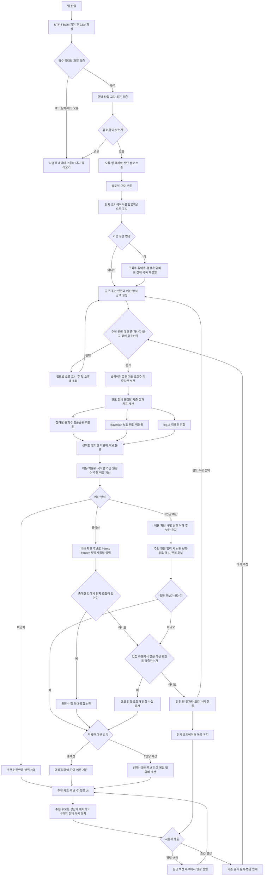

# Creator Match 추천 흐름

아래 흐름은 입력부터 원본 데이터 검증, 점수 계산, 정확 추천, 조건 완화, 정렬과 회복 행동까지 실제 구현 계약을 나타냅니다.

## 계산과 분기 원칙

- 모든 성과 정규화는 현재 쿼리 후보가 아니라 전체 유효 데이터의 실제 팔로워 구간을 기준으로 합니다.
- 추천 전에는 200명 전체를 팔로워 많은 순으로 표시하며 조회수·참여율·평점·협업비 정렬도 제공합니다. 결측 평점과 비용은 해당 정렬에서 마지막에 둡니다.
- 추천 후에는 추천 후보를 상단 상세 영역으로 올리고 추천되지 않은 나머지 크리에이터를 아래 목록에 유지해, 항상 전체 200명을 탐색할 수 있게 합니다.
- 캠페인 목적은 노출–균형–참여의 0~100 슬라이더이며 `균형 탐색` 50이 기본값입니다. 추천 인원은 입력하면 1~20명 범위만 허용하고 비워두면 인원수 제약을 두지 않습니다.
- 추천 인원과 예산 중 하나는 필수입니다. 예산은 총예산과 1인당 예산 중 하나를 선택해 만원 단위로 입력합니다. 총예산은 선택 후보의 평균 협업비 합, 1인당 예산은 각 후보의 평균 협업비 상한입니다. 예산 미입력은 비용 제한 없음과 예산 기여도 `0.5`, 플랫폼·카테고리·규모 미선택은 각 항목의 전체 범위를 뜻합니다.
- 플랫폼을 선택하면 해당 플랫폼 안에서만 카테고리·규모 조건과 추천 점수를 적용합니다.
- 규모를 선택하지 않아도 성과 지표는 각 후보의 실제 팔로워 구간을 모집단으로 정규화합니다.
- 평균순위 백분위는 `(L + (E + 1) / 2 - 1) / (N - 1)`이며 한 행뿐인 모집단은 `0.5`입니다.
- 보정 평점은 `(campaignCount * rating + 5 * 4.415028901734104) / (campaignCount + 5)`입니다.
- 경험은 `log(1 + campaignCount) / log(1 + segmentMaxCampaignCount)`, 예산 효율은 `1 - 동일 규모 내 비용 백분위`입니다.
- 총예산이 있으면 0/1 배낭 문제로 예상 비용 합이 예산 이하인 조합 중 반올림 전 원점수 합이 가장 큰 조합을 선택합니다. 추천 인원을 입력하면 해당 개수만, 비우면 가능한 모든 개수를 비교합니다.
- 1인당 예산이 있으면 비용이 개별 상한 이하인 후보만 남기고, 추천 인원을 입력하면 상위 N명, 비우면 적격 후보 전체를 반환합니다.
- 최종 점수는 슬라이더 위치의 가중치를 사용합니다. 참여율과 조회수는 합계 55% 안에서 노출 0의 조회수 40%·참여율 15%, 균형 50의 각 27.5%, 참여 100의 참여율 40%·조회수 15% 사이를 선형 보간합니다. 평점 20%·경험 15%·예산 10%는 고정하고 반올림 전 원점수로 정렬합니다.
- 플랫폼과 카테고리는 fallback에서도 유지합니다.
- 정확 조합이 없을 때 인접 규모까지만 확인하며 예산을 자동으로 초과하지 않습니다.
- 마이크로의 인접 규모는 나노와 매크로 모두이며, 나노·매크로의 인접 규모는 마이크로입니다.
- 비용 미상 후보는 0원으로 간주하지 않으며 어느 예산 방식이든 추천의 모든 단계에서 제외합니다.
- 결과 영역에는 입력 패널과 중복되는 적용 조건·가중치 요약을 반복하지 않고, 추천 섹션·카드와 예산 방식별 현황을 표시합니다.
- 어떤 조건도 사용자에게 알리지 않고 자동으로 바꾸지 않습니다.
