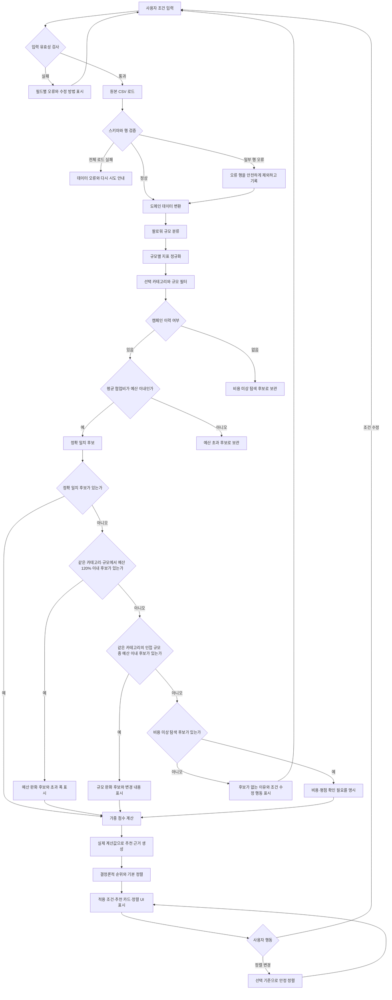

# Creator Match 추천 흐름

아래 흐름은 입력부터 정확 일치 추천, 결측치 처리, 조건 완화, 결과 정렬까지 포함합니다.

## 주요 분기 원칙

- 카테고리는 추천 관련성의 핵심이므로 fallback에서도 유지합니다.
- 예산 조건을 먼저 완화하고, 그다음 인접 팔로워 규모를 검토합니다.
- 캠페인 이력이 없는 후보는 비용과 만족도를 알 수 없는 탐색 후보입니다.
- 어떤 조건도 사용자에게 알리지 않고 자동으로 완화하지 않습니다.
- 추천 근거는 필터 결과와 계산 지표에서 생성합니다.
