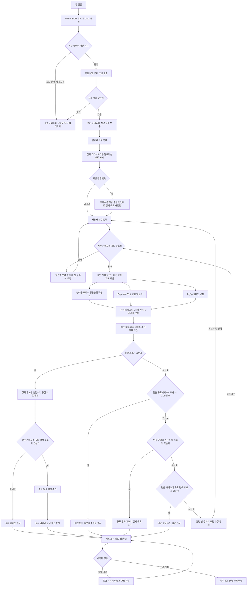

# Creator Match 추천 흐름

아래 흐름은 입력부터 원본 데이터 검증, 점수 계산, 정확 추천, 탐색 후보, 조건 완화, 정렬과 회복 행동까지 실제 구현 계약을 나타냅니다.

## 계산과 분기 원칙

- 모든 성과 정규화는 현재 쿼리 후보가 아니라 전체 유효 데이터의 실제 팔로워 구간을 기준으로 합니다.
- 추천 전에는 200명 전체를 팔로워 많은 순으로 표시하며 조회수·참여율·평점·협업비 정렬도 제공합니다. 결측 평점과 비용은 해당 정렬에서 마지막에 둡니다.
- 평균순위 백분위는 `(L + (E + 1) / 2 - 1) / (N - 1)`이며 한 행뿐인 모집단은 `0.5`입니다.
- 보정 평점은 `(campaignCount * rating + 5 * 4.415028901734104) / (campaignCount + 5)`입니다.
- 경험은 `log(1 + campaignCount) / log(1 + segmentMaxCampaignCount)`, 예산 효율은 `budget / (budget + knownCost)`입니다.
- 최종 점수는 참여율 30%, 조회수 25%, 평점 20%, 경험 15%, 예산 10%이며 반올림 전 원점수로 정렬합니다.
- 카테고리는 fallback에서도 유지합니다.
- 정확 후보가 없을 때 예산 완화, 인접 규모, 비용 미상 탐색 후보 순으로 처음 발견된 한 단계만 표시합니다.
- 마이크로의 인접 규모는 나노와 매크로 모두이며, 나노·매크로의 인접 규모는 마이크로입니다.
- 비용과 평점이 없는 탐색 후보는 중립 기여도를 사용하되 실제 값처럼 표시하지 않습니다.
- 어떤 조건도 사용자에게 알리지 않고 자동으로 바꾸지 않습니다.
