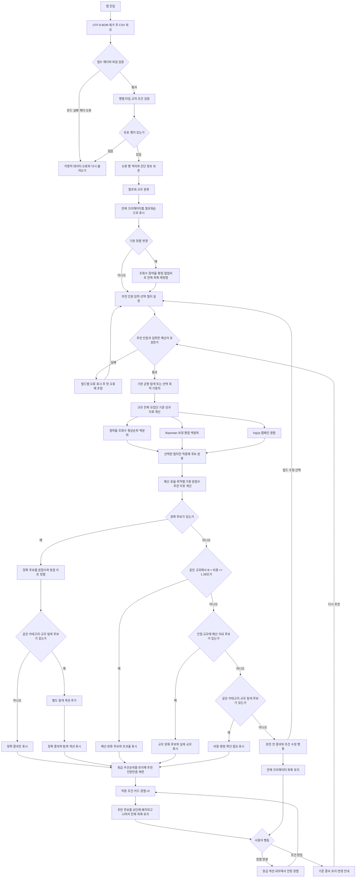

# Creator Match 추천 흐름

아래 흐름은 입력부터 원본 데이터 검증, 점수 계산, 정확 추천, 탐색 후보, 조건 완화, 정렬과 회복 행동까지 실제 구현 계약을 나타냅니다.

## 계산과 분기 원칙

- 모든 성과 정규화는 현재 쿼리 후보가 아니라 전체 유효 데이터의 실제 팔로워 구간을 기준으로 합니다.
- 추천 전에는 200명 전체를 팔로워 많은 순으로 표시하며 조회수·참여율·평점·협업비 정렬도 제공합니다. 결측 평점과 비용은 해당 정렬에서 마지막에 둡니다.
- 추천 후에는 추천 후보를 상단 상세 영역으로 올리고 추천되지 않은 나머지 크리에이터를 아래 목록에 유지해, 항상 전체 200명을 탐색할 수 있게 합니다.
- 캠페인 목적은 `균형 탐색`, 추천 인원은 5명이 기본값입니다. 추천 인원은 1~20명 범위만 허용합니다.
- 예산·카테고리·규모는 선택 필터입니다. 예산 미입력은 비용 제한 없음과 예산 기여도 `0.5`, 카테고리 미선택은 전체 카테고리, 규모 미선택은 전체 규모를 뜻합니다.
- 규모를 선택하지 않아도 성과 지표는 각 후보의 실제 팔로워 구간을 모집단으로 정규화합니다.
- 평균순위 백분위는 `(L + (E + 1) / 2 - 1) / (N - 1)`이며 한 행뿐인 모집단은 `0.5`입니다.
- 보정 평점은 `(campaignCount * rating + 5 * 4.415028901734104) / (campaignCount + 5)`입니다.
- 경험은 `log(1 + campaignCount) / log(1 + segmentMaxCampaignCount)`, 예산 효율은 `budget / (budget + knownCost)`입니다.
- 최종 점수는 선택한 캠페인 목적의 가중치를 사용합니다: 노출 확대는 조회수 45%, 참여 유도는 참여율 45%, 전환 중심은 평점 30%, 균형 탐색은 참여율 30%를 가장 크게 반영합니다. 각 프로필의 전체 비중은 PRD와 결과 화면에 공개하며 반올림 전 원점수로 정렬합니다.
- 직접 전환 지표가 없으므로 전환 중심은 평점·참여율·경험·예산 효율을 대리 지표로 사용하고 그 한계를 결과에 표시합니다.
- 카테고리는 fallback에서도 유지합니다.
- 정확 후보가 없을 때 예산 완화, 인접 규모, 비용 미상 탐색 후보 순으로 처음 발견된 한 단계만 표시합니다.
- 마이크로의 인접 규모는 나노와 매크로 모두이며, 나노·매크로의 인접 규모는 마이크로입니다.
- 비용과 평점이 없는 탐색 후보는 중립 기여도를 사용하되 실제 값처럼 표시하지 않습니다.
- 추천 후보는 등급 우선순위를 유지한 상태에서 사용자가 요청한 인원까지만 표시합니다.
- 어떤 조건도 사용자에게 알리지 않고 자동으로 바꾸지 않습니다.
